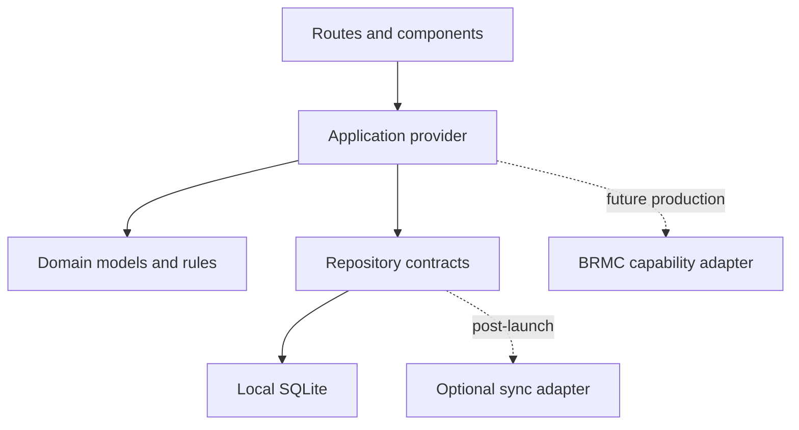

# BattleReef Mobile Architecture

Status: Approved foundation  
Last updated: 2026-09-02

## Architectural principles

1. **Standalone first.** The application must remain useful without BRMC, smart-home platforms, or cloud services.
2. **Offline first.** Local state is authoritative for MVP workflows. Network availability cannot block logging or maintenance.
3. **Capability boundaries.** Domain features never import a device-control SDK. Future integrations enter through explicit adapters.
4. **Progressive enhancement.** Accounts, cloud sync, voice ecosystems, and analytics add value without replacing local functionality.
5. **Security and privacy by design.** Minimize collected data, protect credentials in platform secure storage, and make data movement visible to users.
6. **Migration safety.** Database changes are additive and versioned; release validation includes upgrade tests.

## Runtime stack

| Layer | Technology | Responsibility |
|---|---|---|
| Application | Expo SDK 57 / React Native 0.86 / React 19.2 | Cross-platform runtime |
| Navigation | Expo Router | Typed file-based routes and deep-link readiness |
| Presentation | React Native components and BattleReef tokens | Accessible branded UI |
| Application state | Context provider with repository operations | Selected aquarium and refreshed domain views |
| Persistence | Expo SQLite | Offline structured records and migrations |
| Future secrets | Platform keychain/keystore through SecureStore | Tokens and encryption keys only |
| Future cloud | Adapter behind sync contracts | Optional encrypted backup/sync |
| Future BRMC | Dedicated capability-gated adapter | Matter-compatible hardware integration after production |

## Dependency direction

Domain models do not depend on Expo, SQLite, cloud APIs, smart-home SDKs, or BRMC protocols. This prevents transport and vendor decisions from becoming business rules.

## Current data model

- `aquariums`: system identity, type, volume, creation time
- `parameter_readings`: aquarium, parameter, numeric value, unit, time, note
- `maintenance_tasks`: aquarium, title, due time, completion time
- `app_preferences`: non-sensitive local preferences such as selected aquarium

Foreign keys use cascade deletion at the database boundary. Indexed time columns support chronological log and task queries. All timestamps are stored as ISO 8601 UTC values and formatted in the device locale.

## Future integration boundary

The standalone application may support Siri, Alexa, and Google integrations for informational queries, manual logging, reminders, and user-triggered routines. These integrations must call application use cases; they must not gain a hidden device-control path.

When BRMC is in active production, hardware access will be introduced as a separately permissioned capability with:

- Matter-compatible discovery and commissioning where supported
- Explicit user authorization and clear device ownership
- Authenticated and encrypted local communication
- Command acknowledgement, audit history, stale-state detection, and safe failure behavior
- Read and control permissions separated at the contract level
- A kill switch allowing all remote-control capabilities to be disabled without affecting local records

No placeholder controller, MQTT command client, generic smart-home bridge, or simulated control surface belongs in the pre-BRMC production application.

## Security decisions

- SQLite stores aquarium records; secrets never belong in SQLite or AsyncStorage.
- Future session tokens and encryption keys use iOS Keychain and Android Keystore-backed storage.
- Logs must exclude secrets and minimize personal data.
- Backups and sync are opt-in, encrypted, and recoverable.
- Imported data is validated before persistence.
- Subscription status controls presentation and feature access, never ownership of user-created data.

## Testing strategy

1. Static typing and linting on every change.
2. Repository and domain unit tests for validation, mappings, and migrations.
3. Component tests for empty, loading, populated, and failure states.
4. Device-level flows for onboarding, logging, restart persistence, and offline use.
5. Upgrade tests against previous production database versions.
6. Accessibility checks and representative screen-size visual regression tests.
